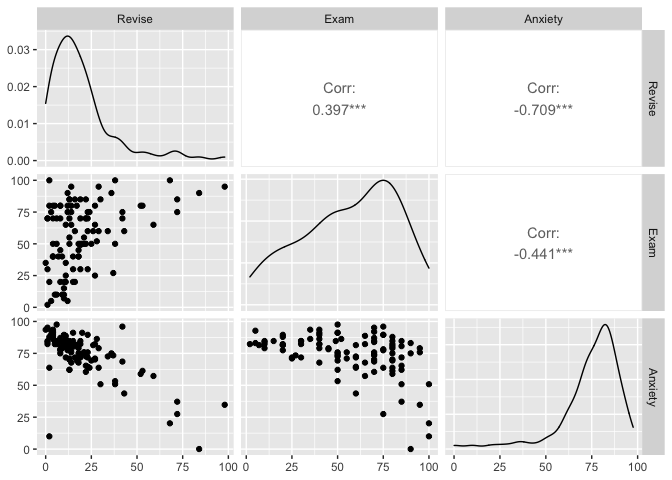
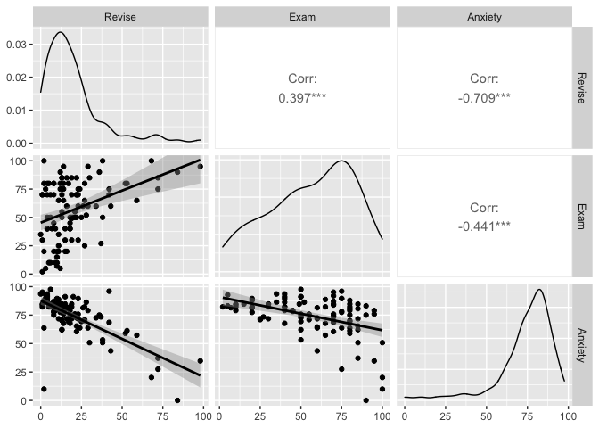

``` r
data=rio::import("Exam Anxiety.sav")
```

# Correlation

## Create a scatterplot matrix

I couldn’t see how to create a scatterplot matrix in Jamovi right away
so I found some R functions. The code is below.

``` r
# The pairs and plots functions are part of baseR

# pairs using column numbers
pairs(data[,2:4], pch = 19)

# pairs using formula format
pairs(~Revise + Exam + Anxiety, data=data, pch = 19)
```


``` r
# Plot
plot(data[ , 2:4] , pch=20 , cex=1.5 , col="#69b3a2")


# the ggpairs function is part of GGally package which expands ggplot2 package

library(ggplot2)
```


``` r
library(GGally)
```

    ## Registered S3 method overwritten by 'GGally':
    ##   method from   
    ##   +.gg   ggplot2

``` r
# ggpairs using column numbers
GGally::ggpairs(data,columns=2:4)
```



``` r
# ggpairs using column names
GGally::ggpairs(data,columns=c('Revise','Exam','Anxiety'),lower = list(continuous = "smooth"))
```


